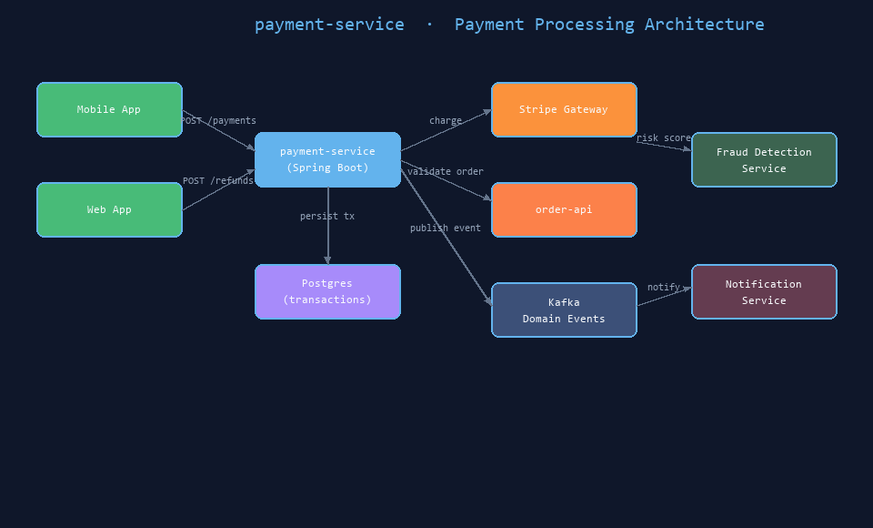
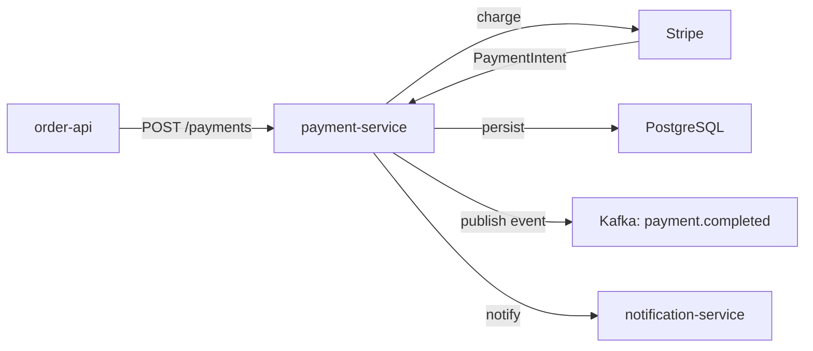

# payment-service

A Spring Boot microservice responsible for processing payments, issuing refunds,
and managing transaction records for the platform.


## Architecture Diagram



*Payment processing flow: mobile/web → Spring Boot → Stripe, order-api, Kafka*

## Purpose

`payment-service` handles all financial transactions. It integrates with an external
payment gateway (Stripe), validates order data from `order-api`, and stores
transaction records in its own Postgres database.

## Technology Stack

- **Java 21** + **Spring Boot 3.3**
- **Spring Data JPA** with Hibernate
- **PostgreSQL** for persistence
- **Stripe Java SDK** for payment gateway integration
- **Prisma** for DB schema management (Node toolchain)
- **JUnit 5** + **Mockito** for unit and integration tests

## Architecture



## API Endpoints

| Method | Path | Description |
|--------|------|-------------|
| POST | /payments | Create and charge a payment |
| GET | /payments/{id} | Get payment status and details |
| POST | /refunds | Issue full or partial refund |
| GET | /refunds/{id} | Get refund status |

## Team

Team: payments | Language: Java | Compliance: PCI-DSS scope

## Running

```bash
mvn spring-boot:run
```

## Testing

```bash
mvn test
```
